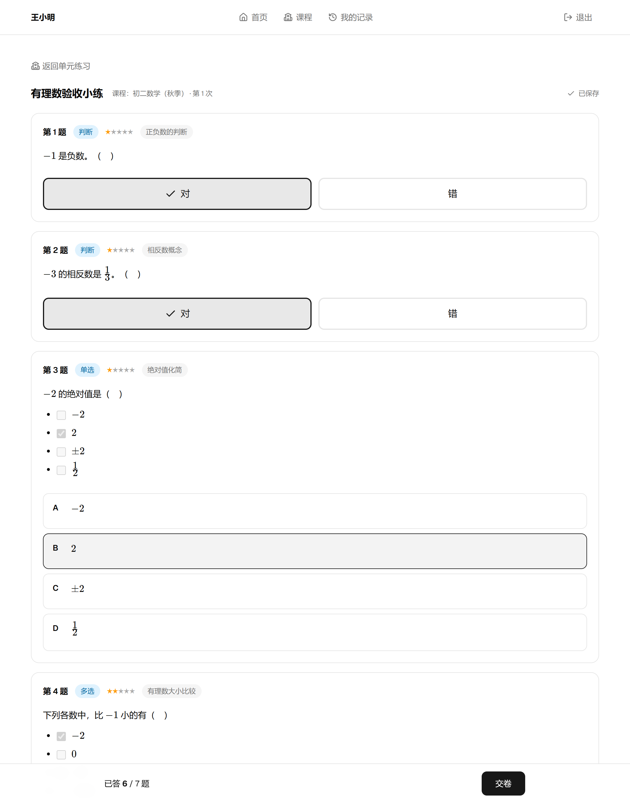
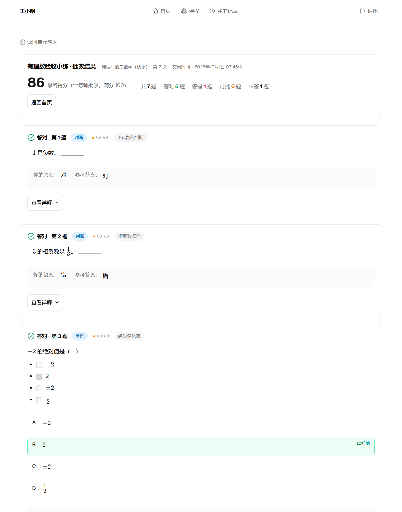
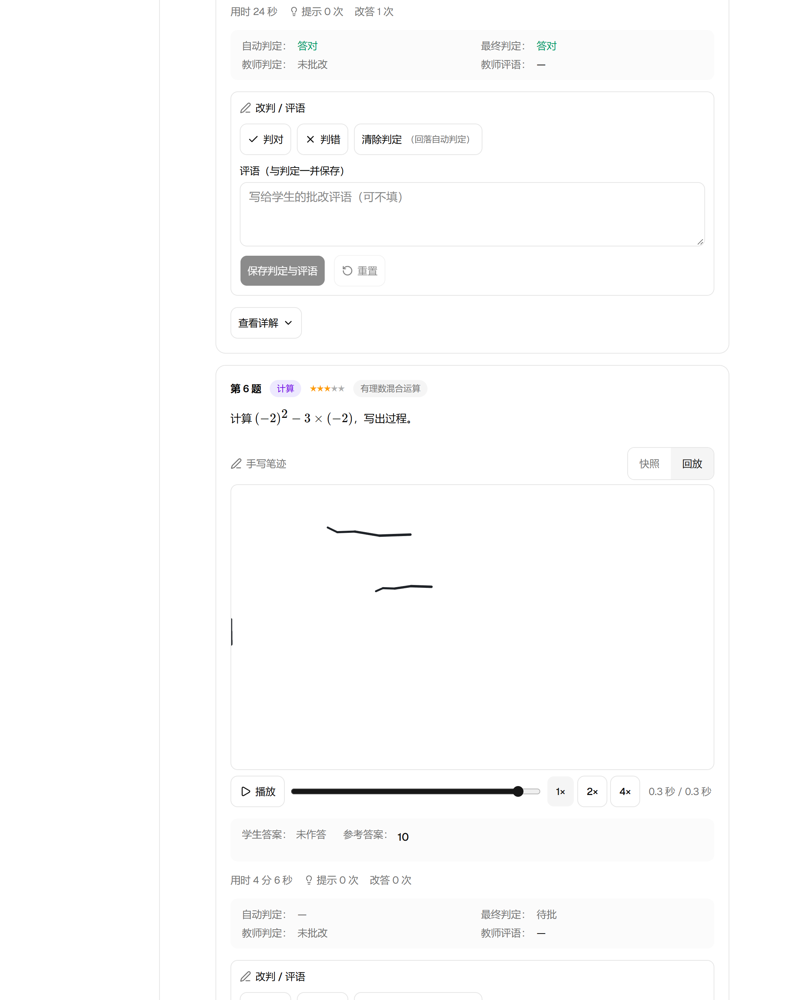
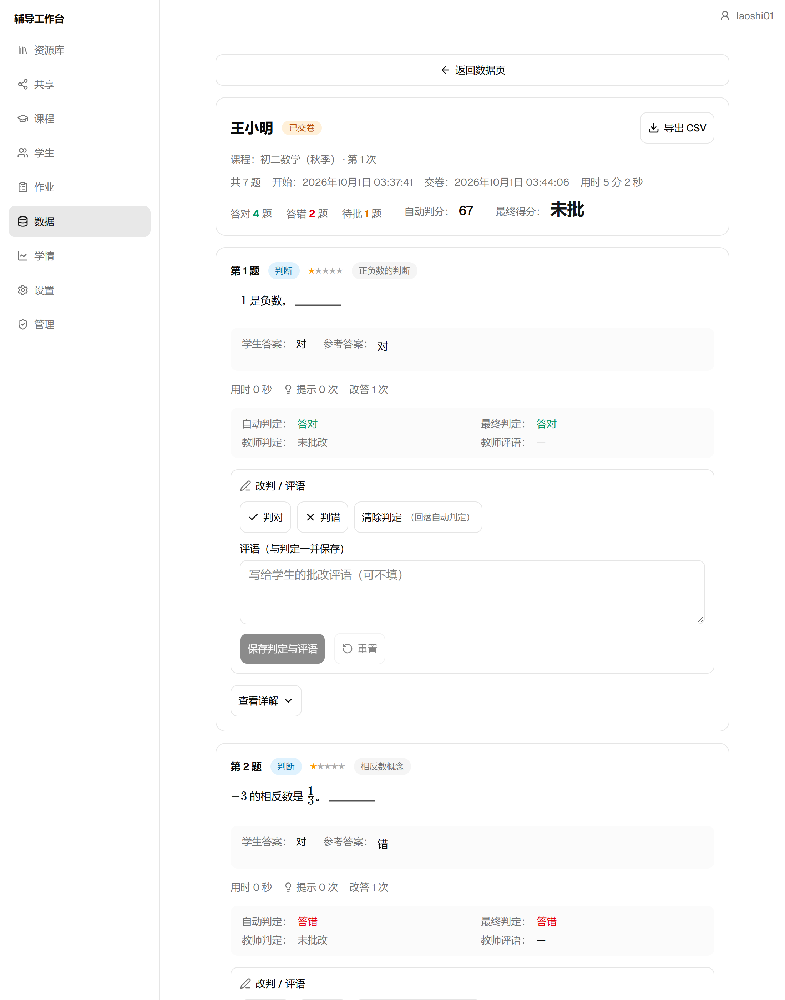
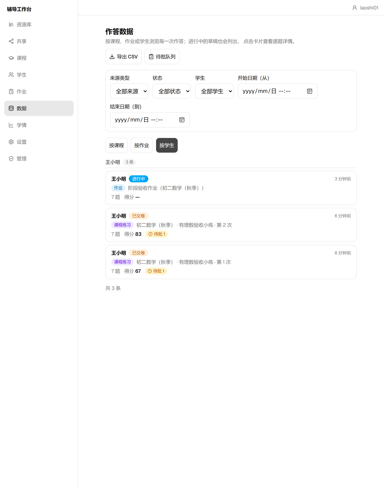
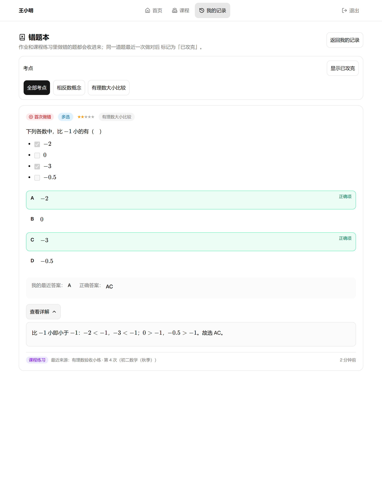

# simple-tutor-tool

[](https://github.com/LIziak112/simple-tutor-tool/actions/workflows/ci.yml)
[](LICENSE)

[简体中文](README.md) · [English](README.en.md)

这是一个为线上一对一辅导老师做的**自部署、AI 原生**讲练工具——最初只是为了解决「讲义散在各个文档里、每个学生的做题情况全靠脑子记」的日常麻烦，后来在一轮轮真实使用中逐渐长成了现在的样子。

它想把一件事做好，并把整条链路串起来：老师（可以借助 AI）按规范写好 Markdown，导入即自动渲染成可互动的讲义与练习；学生打开链接就能答题，包括用 Apple Pencil 手写作答；老师随后在后台看到每个学生逐题的作答、原始笔迹与学情总结；这些结构化数据还能整包交回 AI，帮助准备下一节课。

**单进程、数据自持**：一个 Node 进程同时提供教师端、学生端与全部 API；数据就是本机 `data/` 目录里的一个 SQLite 文件加 blobs 目录（笔迹原图、备份、共享内容都在内），不经任何第三方平台，备份 = 复制目录。

这条主线的核心资产是**贯穿两端的数据结构契约**（[`packages/contract`](packages/contract) 的 Zod schema）：上游，符合契约的 MD 能被自动转成讲义与练习；下游，作答数据是结构化 JSON，AI 可直接消费。

```
AI 产内容（符合 DSL 规范的 MD）──→ 导入自动解析渲染 ──→ 学生互动答题（含手写）
        ▲                                                    │
        └──────── AI 分析学情 / 生成针对性练习 ←── 结构化作答数据 ──┘
```

## 界面一览

| 学生答题（iPad / 浏览器） | 交卷后即时反馈 |
| --- | --- |
|  |  |

| 手写作答 · 笔迹回放 | 教师逐题批阅 |
| --- | --- |
|  |  |

| 作答数据（按学生） | 学生错题本 |
| --- | --- |
|  |  |

## 在线体验

一个随时可以点开玩的演示环境（里面是演示数据，会不定期重置，请勿录入真实学生信息）：

- **学生端**：直接打开专属链接进入——<http://47.116.99.166/s/L_N7GTSUpoWnxzR03laTsnzUP8lqpecS>；或在[学生登录页](http://47.116.99.166/s/login)用姓名「测试」+ 密码 `12345678` 登录。
- **教师端**：打开[教师登录页](http://47.116.99.166/t/login)，登录名 `demo`，密码 `12345678`。

建议完整走一遍链路：学生交卷后，用教师账号进「数据」页，逐题作答、手写原图与学情分析就都在那里了。

## 功能总览

### 内容引擎（MD 进，互动页面出）

- **导入即用**：讲义、练习册或两者混合的 `.md` 一次导入，自动识别类型、解析、上架，中间零手工整理。
- **自动结构化**：练习自动拆成题库（单元、题号、题型、难度、考点、答案、详解）；讲义按"第 X 讲"自动切分成篇。
- **互动渲染**：Markdown 与数学公式（KaTeX，本地打包不走 CDN）自动排版；讲解默认折叠点击展开，答案与详解交卷后才出现。
- **Markdown DSL**：`:::` 容器指令等扩展语法（折叠、提示、分步、函数图、标记……）由指令注册表统一管理，**已发布指令只增不改，旧内容永远可用**；教师端内置 CodeMirror 编辑器带实时 lint 诊断。
- **内置 linter**：`pnpm tutor-lint` 校验 DSL 文档，错误信息可直接回喂给 AI 修正。

### 学生端（零负担使用）

- 浏览器打开**专属链接**，或**姓名 + 密码**登录；免安装、免注册，iPad 可"添加到主屏幕"全屏使用（PWA）。
- **讲义阅读**：公式排版、自动目录、例题解析折叠展开、按"第 X 讲"分篇。
- **线上答题**：判断 / 选择 / 填空 / 手写作答；数学答案可选 MathLive 虚拟键盘输入；Apple Pencil 手写保留笔迹原图。分步提示可解锁。
- **判分与反馈**：客观题交卷即由服务端权威判分；填空与手写题进入教师批改队列。**学生端接口永不下发未交卷题目的答案、详解与提示内容**。
- **记录沉淀**：每次练习的时间、得分、逐题对错随时翻阅；错题本带轮次史、多维度分组与攻克标准，可一键错题重练。
- **草稿防丢**：作答草稿存本地 IndexedDB，刷新 / 锁屏后恢复。

### 教师端（管理内容、获取数据）

- **多教师域隔离**：各教师的资源库、课程、作业与学生完全隔离；首位教师即管理员，管理端可管账号、注册开关与教师间共享目录。
- **资源库**：单元 / 讲义的导入、预览、编辑、排序、软删除与组织归类；内容是可维护的资产，不是一次性导入物。
- **导入向导**：lint 门禁 + dry-run 预览 + 按文件选择性导入。
- **课程与作业**：建课、学生名单、布置作业向导（每单元一份或合并成一份）。
- **批改**：填空 / 手写题逐题批注对错并写评语，参考答案 LaTeX 渲染。
- **作答数据**：按学生查看每次提交——逐题答案、判分结果、每题用时、手写原图。
- **学情分析**：掌握度矩阵、周趋势、重点考点、题目统计与学生画像（ECharts），为下一节课讲什么提供直接依据。
- **导出与备份**：提交记录导出 CSV；一键下载完整备份 zip（自动先拍数据库快照）、上传恢复（密码确认 + 恢复前自动快照可回滚）。

### AI 原生（三层接入）

| 层 | 方式 |
| --- | --- |
| 制作端（AI 产内容） | DSL 规范 + 提示词模板 + linter（`/spec` 路由对外提供）：把规范交给任何 AI，它产出的 MD 即可直接导入。老师从"写材料"变成"审材料"。这些资产还打包在 [`dsl-kit/`](dsl-kit/) 文件夹（含「材料整理」技能 SKILL.md 与单文件离线校验脚本 `tutor-lint.mjs`，Node ≥20 直接 `node` 运行），拷给自己的 AI 工具即可离线使用。 |
| 数据端（AI 读数据） | 一键导出"AI 学情数据包"：结构化作答数据 + 预置提示词，交给 AI 即得错误分布、薄弱考点与下节课建议。 |
| 实时接入（MCP Server） | 内置 MCP（`/mcp`，教师 API Token 鉴权）：Claude 等 AI 客户端可直接列学生、取学情包、写报告、取 DSL 规范、校验并导入内容。 |

## 技术栈

| 分类 | 选型 |
| --- | --- |
| 语言 / 契约 | TypeScript（strict，禁 `any`）· Zod v4（同一份 schema 前后端共用，并导出 JSON Schema 给 AI） |
| 前端 `apps/web` | React 19 · Vite · Tailwind CSS v4 · shadcn/ui（Radix）· TanStack Query · Zustand · React Router v7 · CodeMirror 6 · ECharts · KaTeX · MathLive · Excalidraw + Atrament（手写，经 `InkSurface` 适配层）· vite-plugin-pwa |
| 后端 `apps/server` | Node.js ≥ 24 · Hono（前端用 `hc` RPC 客户端获得端到端类型）· better-sqlite3（WAL）· Drizzle ORM + drizzle-kit · pino · MCP SDK |
| 共享包 `packages/` | `contract`（Zod 数据契约，唯一事实来源）· `md-dsl`（基于 unified / remark 的解析器 + linter）· `grading`（纯函数判分，仅服务端执行） |
| 质量 | Vitest（单测 2300+）· Playwright（E2E，Chromium + WebKit iPad 模拟）· Biome（lint + format）· GitHub Actions CI |
| 部署 | Docker 多阶段构建单容器 + Caddy 反代（自动 HTTPS）；或 `node dist` + systemd |

## 架构与仓库结构

```
┌──────────────────── 一个 Node 进程（apps/server） ────────────────────┐
│  静态资源：apps/web 构建产物（SPA + PWA + KaTeX 字体）                  │
│  /api/teacher/*（Cookie 会话）   /api/student/*（专属链接令牌）         │
│  /mcp（教师 API Token）          /spec/*（DSL 规范、JSON Schema、提示词）│
│  领域服务：内容 / 作答 / 学习痕迹 / 学情聚合 / 导出 / MCP               │
│  data/tutor.db（SQLite WAL）· data/blobs/（笔迹）· data/backups/       │
└───────────────────────────────────────────────────────────────────────┘
     ▲ 老师（电脑浏览器）        ▲ 学生（iPad / 手机 / PC，PWA）    ▲ AI 客户端（MCP）
```

所有契约来自 `packages/contract`，前端、后端、MCP 与导出文件共用一份 schema。

```
simple-tutor-tool/
  apps/
    web/        # React 前端（学生端 + 教师端，一个 SPA 按路由分区）
    server/     # Hono 后端（API + 静态资源 + MCP + SQLite）
  packages/
    contract/   # Zod 数据契约（唯一事实来源）+ JSON Schema 导出
    md-dsl/     # DSL 解析器 + linter + CLI（tutor-lint）
    grading/    # 纯函数判分（服务端权威执行）
  docs/         # 架构、部署、DSL 规范、功能清单、进度等文档
  dsl-kit/      # 一站式分发包：DSL 规范 + 完整样例 + 提示词模板 + 材料整理技能（拷给自己的 AI 工具即可用）
  samples/      # 样例 MD（v1/v2 各一套），同时作为解析器兼容性回归夹具
  e2e/          # Playwright E2E
```

## 快速开始

### 开发模式

环境要求：Node.js ≥ 24、pnpm 12.6.0。

```bash
pnpm install          # 安装依赖
pnpm seed:demo        # 可选：灌入演示数据（教师/学生/课程/作答）
pnpm dev              # 并行启动 server（8787）与 web（Vite，默认 5173，/api 自动转发）
```

浏览器打开 Vite 地址（默认 `http://localhost:5173`）：首次启动进入教师端设置向导（设置登录名 + 密码，首位教师即管理员），之后可建课、加学生、导入 `samples/` 里的样例文档体验全流程。E2E 需先 `npx playwright install`。

### 生产部署（详见 [docs/部署.md](docs/部署.md)）

方式一：Docker Compose（推荐，自带 Caddy 反代与健康检查）：

```bash
git clone https://github.com/LIziak112/simple-tutor-tool.git && cd simple-tutor-tool
mkdir -p data && sudo chown -R 1000:1000 data    # 容器内以 uid 1000 的 node 用户运行
docker compose up -d --build                     # 浏览器打开 http://localhost（云服务器用公网 IP）
```

发布版本 tag 后，CI 会自动把镜像推到 GHCR（`ghcr.io/liziak112/simple-tutor-tool`）；不想本地构建时，快速试用也可以：

```bash
docker run -d -p 8787:8787 -v ./data:/app/data ghcr.io/liziak112/simple-tutor-tool
```

方式二：`pnpm build` 后 `node apps/server/dist/index.js`，配 systemd 常驻（文档见部署 §2）。

关键环境变量：

| 变量 | 默认 | 说明 |
| --- | --- | --- |
| `PORT` | `8787` | 服务监听端口 |
| `DATA_DIR` | `./data` | 数据目录（tutor.db、blobs/、shared/、backups/、secret.key 全在内，备份 = 备份此目录） |
| `PUBLIC_URL` | `http://localhost:8787` | 对外访问地址；为 `https://` 时启用 Secure Cookie 与 PWA Service Worker |

公网部署建议：在管理端关闭教师自助注册（注册是匿名可达接口，虽有 IP 限流）。

## 常用命令

| 命令 | 作用 |
| --- | --- |
| `pnpm dev` / `pnpm build` | 开发（并行） / 全量构建 |
| `pnpm test` / `pnpm e2e` | 单元测试（Vitest） / E2E（Playwright，Chromium + WebKit） |
| `pnpm lint` / `pnpm typecheck` / `pnpm format` | Biome 检查 / 类型检查 / 格式化 |
| `pnpm db:generate` | 修改 Drizzle schema 后生成数据库迁移（禁止手改线上库） |
| `pnpm schema:export` | 导出内容契约 JSON Schema（改 contract 后须重跑并提交） |
| `pnpm gen:spec` | 从指令注册表生成 `docs/dsl/规范.md`、`提示词模板.md` 并刷新 JSON Schema，同时同步 `dsl-kit/` 分发包并打包其离线校验脚本 `tutor-lint.mjs`（改注册表/lint/契约后必跑，CI 校验产物无漂移） |
| `pnpm tutor-lint <文件或目录>` | 校验 DSL 文档，有 error 时退出码 1 |
| `pnpm reparse [--dry-run]` | 解析器升级后从库内原文重抽取结构化字段（题目 id 不变） |
| `pnpm seed:demo` | 灌入演示数据 |

## 质量红线

- **防泄题**：学生端 API 永不返回未交卷题目的答案、详解、提示；新增学生端接口必须附泄露测试（assertNoLeak）。
- **判分只在服务端**执行（`packages/grading`），客户端结果不可信。
- **契约优先**：数据结构改动先改 `packages/contract`，禁止前后端各自手写同一类型。
- **DSL 兼容**：`samples/` 历史样例是兼容性回归测试，任何改动后必须仍能解析、渲染一致。
- CI（[.github/workflows/ci.yml](.github/workflows/ci.yml)）：lint / typecheck / 单测 / gen:spec 漂移校验 / build / E2E 全过才可合并。

## 文档索引

| 文档 | 内容 |
| --- | --- |
| [docs/技术架构与实施方案.md](docs/技术架构与实施方案.md) | 架构决策与实施蓝图（权威文档） |
| [docs/部署.md](docs/部署.md) | 部署、备份恢复、多教师、常见问题 |
| [docs/页面功能清单.md](docs/页面功能清单.md) | 页面级功能规格 |
| [docs/项目最终愿景.md](docs/项目最终愿景.md) | 产品定位与愿景 |
| [docs/dsl/](docs/dsl/) | DSL 规范、完整样例与给 AI 的提示词模板（`pnpm gen:spec` 生成，`/spec` 路由对外提供） |
| [dsl-kit/](dsl-kit/) | 给用户 AI 工具的一站式分发包：DSL 规范 + 完整样例 + 提示词模板 + 材料整理技能（SKILL.md）+ 单文件离线校验脚本（tutor-lint.mjs） |
| [docs/进度表.md](docs/进度表.md) | 开发任务进度与验收记录 |
| [AGENTS.md](AGENTS.md) | 开发工作约定（硬性规则，对人和 AI 执行者同样生效） |

## 许可证

[MIT](LICENSE)——可自由使用、修改与部署。如果它在你的教学里帮上了忙，欢迎回来提个 issue 或聊聊你的场景，这会比 star 更让我们高兴。
