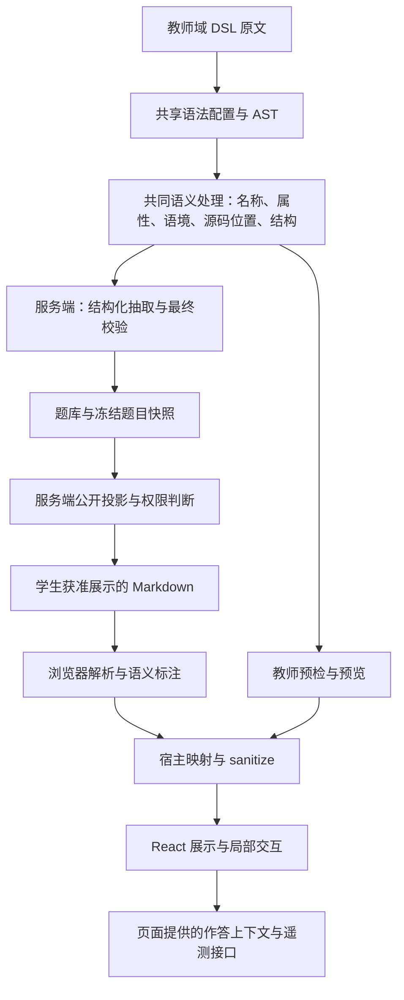

# 组件渲染核心评审与改进建议

> 状态：评审报告与改进提案，尚未实施代码修复，不替代已经生效的架构决策。
> 日期：2026-10-06。代码核对基点：`7e173a0564bab4a7d18a3ee8351b704029e8d34f`，同时核对当前工作区相关文件。
> 范围：指令契约、解析/lint、学生题干投影、React 渲染、目录、交互状态、遥测及组件建设流程。
> 配套导航：[组件渲染核心与组件构建流程](组件渲染核心与组件构建流程.md)；架构权威：[技术架构与实施方案](技术架构与实施方案.md)；实施纪律：[AGENTS.md](../AGENTS.md)。
> 本次交付仅修改这两份手写文档；没有修复业务代码、调整契约、生成迁移、运行 reparse 或改写历史作答。

## 1. 结论与决策摘要

现有方向值得保留：通用指令语法降低 AI 编写成本；注册表是扩展入口；`RichMarkdown` 统一展示；原文支持追溯和重解析；判分与公开载荷控制留在服务端。

当前最主要的缺口是：**同一内容的领域语义仍由多个模块独立解释**。相同 remark 插件只能提供接近的语法基础，不能自动保证答案抽取、脱敏、步骤数量、目录和遥测定位一致。继续增加组件前，应先把已经出现分歧的语义收敛为可测试的共同规则。

建议按以下顺序推进：

1. 封住私密内容和编码答案进入学生载荷的路径，并停止嵌套详解污染答案抽取。
2. 保证组件分派可靠，隔离用户属性与内部元数据。
3. 统一结构约束、属性解析、别名、步骤计数、标题提取与编号。
4. 明确文档身份、交互状态、遥测归属及资源生命周期。
5. 将规范变成回归测试和 CI 检查，再扩展组件能力。

不建议立即重写渲染器、引入第二套 DSL、建立动态插件市场或持久化整棵 AST。先在既有包边界内抽取小型纯函数，修复已确认问题，再按实际需求扩大抽象。

## 2. 证据等级、优先级与边界

### 2.1 证据等级

| 等级 | 含义 | 本报告能支持的结论 |
| --- | --- | --- |
| A：已复现 | 使用现有函数或 React 组件探针观察到具体结果 | 对给定输入的缺陷成立；不等同于线上发生过事故 |
| B：源码确认 | 已定位实现缺口或多处维护事实 | 机制存在；未来扩展或特定组合的影响仍需补测试 |
| C：待场景验证 | 代码显示风险，但完整触发依赖路由复用、设备或第三方库 | 先验证，再确定最终修复范围 |

P1 表示安全、判分输入或基本可用性问题，应优先处理；P2 表示结构一致性、兼容性或局部行为问题。优先级与证据等级独立，不把推测写成已发生事故。

### 2.2 验证边界

- 前两轮评审执行过相关测试：20 个测试文件、292 项测试通过。命令与输出见第 9 节；这是历史验证记录，不是本次文档编辑后重新运行的结果。
- React 临时探针记录了当前异常行为；探针运行通过不表示产品行为符合预期，部分探针是记录观察结果。
- 编码答案、嵌套答案污染和目录差异通过直接调用现有函数复现；不写数据库、不访问线上。
- 本报告没有证明生产数据已受影响，也没有完成所有学生 API 的端到端审计。
- 没有完成真实 iPad、浏览器视觉和图表尺寸验证；未测量性能，不能断言当前存在性能瓶颈。
- 调查时工作区存在未跟踪的 `apps/web/src/features/markdown/review-probe.tmp.json`，它是诊断记录，不是生产输入或正式测试；本文保留必要证据，不依赖该临时文件长期存在。

## 3. 问题总表

| 编号 | 优先级 | 证据 | 问题 | 主要影响 | 建议阶段 |
| --- | --- | --- | --- | --- | --- |
| R01 | P1 | A | 嵌套私密容器残留在公开题干 | 提示/答案/详解提前下发 | A |
| R02 | P1 | A | 字符实体形式的填空绕过脱敏和检测 | 参考答案进入浏览器数据 | A |
| R03 | P1 | A | 嵌套详解中的填空被抽取为标准答案 | 答案数量和归属错误 | A |
| R04 | P1 | A | 未知指令命中对象继承属性 | 当前渲染子树抛 React 错误 | B |
| R05 | P2 | A | 用户属性覆盖指令身份与编号 | 错组件、错误遥测定位 | B |
| R06 | P2 | A | kind、直接父子关系和步骤总数口径不一致 | 无效结构被接受、按钮与统计不符 | C |
| R07 | P2 | B | 属性契约未贯穿 sanitize 和组件 | 新属性静默丢失、默认行为漂移风险 | C |
| R08 | P2 | A | 正则目录与 AST 标题提取不同 | 目录漏项、伪标题和跳转错位 | C |
| R09 | P2 | B | 别名归一晚于语义编号 | 增加别名后可能组件正确、编号错误 | C |
| R10 | P2 | A | 正文身份变化没有统一状态策略 | 新正文继承旧展开状态 | D |
| R11 | P2 | C | 固定回调捕获首次讲义 ID | 路由复用时事件可能归属错误 | D |
| R12 | P2 | C | 图表尺寸和资源生命周期约定不足 | 旋转/分栏/卸载场景待验证 | D |

所有条目当前均为**未修复或待验证**，不能因为已写入文档而关闭。

## 4. 逐项分析与验收建议

### R01：嵌套私密容器进入学生题干

**证据 A，P1。** 位置：[question.ts](../packages/md-dsl/src/v2/question.ts) 的 `extractQuestion`；[directives.ts](../packages/md-dsl/src/lint/directives.ts) 的语境校验；[public-stem.ts](../packages/md-dsl/src/v2/public-stem.ts) 的 `studentStemMd` 与检测器。

最小完整样例：

```markdown
---
kind: practice
unit: 渲染评审
---
:::::question{type=fill}
计算 [[4]]。
::::box
:::solution
秘密内容 REVIEW42。
:::
::::
:::::
```

把 `solution` 分别替换成 `hint`、`answer`，三者均观察到：lint 无 issue，公开题干保留 `REVIEW42`，泄露检测返回 `false`。

**根因：** 解析器只从 question 的直接子级抽取私密容器；位置校验允许祖先链中的 question；公开投影只清理部分答案标记，没有删除残留私密容器。公开 Zod schema 可以剥离私密字段名，却不能识别 `stemMd` 字符串内的私密正文。

**影响路径：** [attempt-service.ts](../apps/server/src/services/attempt-service.ts) 的 `publicOfSnapshot` 与 [assignment-service.ts](../apps/server/src/services/assignment-service.ts) 的 `publicQuestionsOfRows` 均调用该投影。已经确认函数级缺陷和调用关系，尚未向真实 API 导入该样例。

**建议：** 为题目建立统一的私密子树识别规则，抽取和投影共同使用；公开投影必须能处理历史脏数据，不能只修导入 lint。嵌套内容是递归归属题目还是禁止新导入，需先做兼容决策，但任何分支都不能继续泄露。

**验收：** 直接/多层嵌套、box/columns/未知外层、别名及历史冻结题干均覆盖；整个未交卷响应不含专用秘密字符串；合法题面保留；讲义中允许公开的 solution 不被全局误删。测试域严格区分“题干投影”与其他获准内容接口。

### R02：编码形式的答案绕过脱敏

**证据 A，P1。** 位置：[public-stem.ts](../packages/md-dsl/src/v2/public-stem.ts) 的 `publicStemMd`、`stemMdLeaksAnswers`；[question.ts](../packages/md-dsl/src/v2/question.ts) 的 `scanStem`。

把 R01 样例的题目正文换为以下一行，不带私密容器：

```text
计算 &#91;&#91;SECRET42&#93;&#93;
```

观察结果：

| 环节 | 当前结果 |
| --- | --- |
| lint | 0 issue |
| 标准答案 | `blanks: [["SECRET42"]]` |
| 学生题干 | 原样保留包含 SECRET42 的字符串 |
| 泄露检测 | `false` |

**根因：** AST 文本已解码字符实体，抽取器在解码值中识别到 `[[SECRET42]]`；脱敏和检测的快路径却根据原文是否包含字面量 `[[` 决定跳过。即使去掉快路径，后续对原文做相同正则替换仍不能覆盖全部编码形式。

**建议：** 定义唯一的空位识别语义，并正确关联解码值和原文区间。不能直接把解码后的字符下标当作原文偏移；也不宜用全篇 decode/重新序列化替代源码保护。若暂时无法安全投影某种写法，应产生可诊断失败，不能返回原始私密内容。

**验收：** 字面量、十进制/十六进制字符实体、转义与混合形态；CRLF、中文、多空、多段、公式/代码排除；投影后二次解析无可判定答案，空位数量和顺序不变，重复投影幂等。检测器必须另有不复用同一危险快路径的断言。

### R03：嵌套详解污染标准答案

**证据 A，P1。** 位置：[question.ts](../packages/md-dsl/src/v2/question.ts) 的题干分区与 `scanStem`；[lint/questions.ts](../packages/md-dsl/src/lint/questions.ts) 的同名扫描函数。

R01 样例中题干写 `[[4]]`，嵌套 solution 内写 `详解中 [[99]]`。lint 无 issue，但解析答案为 `[["4"], ["99"]]`。

**根因：** 解析器没有剥离嵌套私密容器，继续扫描其标记；linter 递归跳过私密容器，两者实际扫描的题干不同。当前结果已能证明标准答案输入错误，尚未断言某次线上判分已经受影响。

**建议：** 把“哪些子树属于题干”提取为共享遍历规则。题目内的私密子树不得参与空位、选项和答案识别；讲义语境独立处理。

**验收：** 对合法填空题，标准答案组数、公开题干作答空位数、输入控件数及顺序一致；私密内容中的标记和任务列表不增加答案或选项。题库修正、重解析、历史冻结快照和既有成绩分别评估，禁止自动改写历史判分。

### R04：未知指令导致 React 渲染异常

**证据 A，P1。** 位置：[directives/index.tsx](../apps/web/src/features/markdown/directives/index.tsx) 的 `createDirectiveHost`。

```markdown
:::constructor
应保留的正文。
:::
```

实际报错：`Objects are not valid as a React child`，错误对象包含组件 props 的键。

**根因：** 普通对象 `directiveComponents[primaryName]` 会命中继承的 `constructor`，没有进入 UnknownDirective。TypeScript 的 `Record` 不会在运行时消除原型链。

**建议：** 使用 `Map` 或自有属性检查；查表只接受实际注册且绑定的组件。复杂组件增加局部错误边界，但错误边界不能替代修复查表问题。

**验收：** 普通未知名、`constructor`、`toString` 等边界输入均不执行非注册组件；合法解析为指令的未知输入保留正文；错误局限于单个块。新增指令不得只靠数量相等检查，应验证注册主名与组件键集合一致。

### R05：DSL 属性覆盖内部元数据

**证据 A，P2。** 位置：[remark-directive-host.ts](../apps/web/src/features/markdown/remark/remark-directive-host.ts) 的 `annotate`；[directives/index.tsx](../apps/web/src/features/markdown/directives/index.tsx) 的 `readDirective`。

```markdown
:::tip{directive=fold dindex=999}
内容。
:::
```

直接渲染得到 fold；点击事件为 `{name: "fold", index: 0, action: "open"}`。`999` 没有变成有效编号，而是以字符串覆盖数字后被读取逻辑回退为 0。

**根因：** 内部字段先写入，随后用户属性写入同一对象。linter 对未知属性的警告不会在运行时隔离它们，未通过 lint 的教师实时预览也能进入此路径。

**建议：** 业务属性与内部元数据分域；内部保留键不可覆盖；业务属性经注册表校验和使用位置的安全规则后消费。仅调整赋值顺序可以止住一部分覆盖，但长期应避免共享命名空间。

**验收：** `directive/index/dindex/dclass` 及大小写、空值等输入不会改变内部身份；普通业务属性保留；编号保持数字；非法属性有诊断且不能悄悄改变组件。

### R06：结构规则没有覆盖真实组件假设

**证据 A，P2。** 位置：[lint/directives.ts](../packages/md-dsl/src/lint/directives.ts)、[Steps.tsx](../apps/web/src/features/markdown/directives/Steps.tsx)、[lecture-structure.ts](../packages/md-dsl/src/v2/lecture-structure.ts)。

复现片段，lint 时外加 lecture frontmatter 与 H1：

```markdown
:::::steps
步骤说明。
::::box
:::step
第一步内容。
:::
::::
:::step
第二步内容。
:::
:::::
```

lint 无 issue；服务端 `totalSteps=1`；前端初始显示“还剩 2 步”；点击一次后两步均已显示，按钮仍存在。另一个输入 `:fold[内容]` 不符合注册 kind，但当前 lint 无 issue。

**根因：** allowedIn 检查祖先链；服务端只数直接 step 子级；前端数 React children（包含说明段落/其他容器）；编号遍历又按其自身规则计数。

**建议：** 区分语法种类、祖先语境、直接父级、允许子级和嵌套作用域。推荐步骤总数来自语义分析；说明文字不是步骤；嵌套 steps 的归属应明确。不要通过对 React children 做脆弱的组件类型猜测修补语义。

**兼容决策：** 历史上接受过的嵌套结构可能受影响。决定新结构错误是 warning、阻断导入还是兼容归一前，先扫描历史语料；这项提案不能直接覆盖“已发布指令只增不改”。未知指令仍遵守既有 warning + 降级规则。

**验收：** 零/一/多步、说明段落、间接 step、嵌套 steps、错误 kind、别名；前端显示数、服务端总数、最大 reveal.step 一致。没有实际下一步时不保留按钮。

### R07：属性契约尚未成为渲染行为的单一来源

**证据 B，P2。** 位置：[contract/directives.ts](../packages/contract/src/directives.ts)、[sanitize.ts](../apps/web/src/features/markdown/sanitize.ts)、[types.ts](../apps/web/src/features/markdown/directives/types.ts) 和各组件。

目前 Zod schema、`DIRECTIVE_HOST_ATTRS`、组件的字符串转换/默认值分别维护。宿主没有消费 schema 解析结果；例如 mark 的默认颜色、question 的难度解析在组件内再次实现。

**风险：** 新属性可能被 sanitize 删除；schema 中的默认值不自动进入组件；预览对非法数值的回退可能与服务端不同。本项没有声称已经发生所有可能的属性丢失。

**建议：** 统一属性解析入口，输出由契约推导的类型与诊断；清晰区分严格导入验证和容错预览。允许字段的列表可由已审查契约派生或做集合测试，但 URL/CSS/表达式安全策略不能由“字段已注册”自动放宽。

**验收：** 每个可展示业务属性有至少一个端到端传递断言；schema 缺省值与实际组件行为一致；非法值产生明确回退或占位；预览与最终保存的差异可见。保留首发必填属性，不为了统一接口而给 `image.src` 或 `graph.fn` 伪造默认值。

### R08：目录和标题语义漂移

**证据 A，P2。** 位置：[outline.ts](../apps/web/src/features/markdown/outline.ts) 的 `extractOutline`；[lecture.ts](../packages/md-dsl/src/v2/lecture.ts) 的标题抽取；[StudentLectureViewPage.tsx](../apps/web/src/pages/student/StudentLectureViewPage.tsx) 的 `scrollToHeading`。

直接对同一输入调用目录提取与 processor，确认：缩进两个空格的 ATX 标题和 setext 二级标题被 AST 识别但目录漏掉；四反引号开栏遇到三反引号时，正则目录提前认为代码结束；带加粗/行内代码的目录文字仍保留语法标记。

**影响：** 第 N 个目录项与第 N 个正文 H2/H3 失去对应，目录跳转错位；目录跳转事件与正文小节位置不一致。样例一致性测试只能证明已包含的语料，不能证明所有 Markdown 输入。

**建议：** 共用 AST 标题识别和纯文本提取规则；DOM 定位限制在当前渲染根内。允许的标题语法若要收窄，必须通过明确规范与诊断实施，不能只写在注释里。

**验收：** 缩进、setext、不同围栏长度、引用/列表中的标题、重复标题、强调/链接/代码/公式标题。分别测试目录标题列表与 DOM 定位，公式不要盲目比较包含 KaTeX 辅助文本的整个 textContent。是否允许隐藏容器内标题沿用既有规则，另行变更须评审。

### R09：别名与编号的执行时机不一致

**证据 B，P2。** 位置：[remark-directive-host.ts](../apps/web/src/features/markdown/remark/remark-directive-host.ts) 直接比较 `node.name`；组件宿主才调用 `getDirective` 归一主名。

**风险：** 后续为 question/hint/steps/step 增加别名，可能渲染到正确组件却没有正确语义编号。当前没有把一个尚未发布的别名当作生产缺陷复现。

**建议：** 进入语义处理时归一名称；保留原始名称用于诊断。作用域也应独立表达：文档全局序号、当前题目的提示/空位序号、当前 steps 的步骤序号不能靠一个不断上传的计数器隐式推断所有边界。

**验收：** 主名与别名在解析、投影、编号、组件选择、遥测上等价；相邻题目、讲义提示和嵌套容器不串号。显示序号、文档序号、持久身份在接口与文档中分别命名。

### R10：正文更换后的交互状态归属不明确

**证据 A，P2。** 位置：[LabeledFold.tsx](../apps/web/src/features/markdown/directives/LabeledFold.tsx) 的本地 open 状态；[Steps.tsx](../apps/web/src/features/markdown/directives/Steps.tsx) 的 revealed；[RichMarkdown.tsx](../apps/web/src/features/markdown/RichMarkdown.tsx)。

复现：打开旧正文的 fold，在同一组件实例 rerender 为同位置的新 fold，新正文初始已展开。它证明状态复用存在，不代表所有页面导航都会触发。

**建议：** 由宿主提供明确的内容身份/修订边界；不同文档通常重置，编辑同一文档是否保留展开应有产品约定。不要以完整 source 字符串作为每次输入都变化的重挂载 key，否则会丢焦点和输入状态。

**验收：** 同文档编辑、不同文档切换、题目快照切换、步骤减少、外层 fold 关闭再打开、输入焦点与草稿保留。折叠只是本地展示状态，绝不能作为答案权限控制。

### R11：固定遥测回调可能使用旧讲义身份

**证据 C，P2，待路由复用验证。** 位置：[StudentLectureViewPage.tsx](../apps/web/src/pages/student/StudentLectureViewPage.tsx) 的 `onDirectiveTelemetry`、`trackSectionFocus`、`onOutlineNavigate`；[event-queue.ts](../apps/web/src/lib/event-queue.ts) 的 `track`。

回调用 `useRef(函数).current` 固定，捕获初次渲染的 id；队列随 id 更新，版本引用也随数据更新。队列 track 原样接收事件，不替调用者改写 lectureId。若组件在 A→B 路由变化时复用，可能发送旧 id 与新版本的组合。

**建议：** 回调读同一份当前文档上下文，或随身份重建并正确管理订阅。保留已有 `lectureUpdatedAt` 版本校验，不误认为项目完全没有版本机制。

**验收：** 使用真实路由在同一实例内切换 A→B，记录进入、展开、目录跳转、阅读定位、离开事件；id/版本/序号始终来自同一文档。补慢请求乱序、缓存命中和返回导航场景后再最终确认严重程度。

### R12：资源组件缺少完整的布局与生命周期验收

**证据 C，P2。** 位置：[Media.tsx](../apps/web/src/features/markdown/directives/Media.tsx) 的 GraphDirective。已具备动态加载、加载/失败状态、重试和 disposed 防异步回写，这些应保留。

组件绘制时读取 clientWidth，effect 依赖 fn/range/attempt；组件本身未监听容器尺寸变化。是否有第三方库内部补偿、是否造成真实溢出，仍需浏览器验证。当前没有证据证明必然内存泄露，也未证明表达式引擎可执行任意代码。

**建议：** 先测 iPad 旋转、分栏宽度变化、隐藏后显示和快速切换表达式；若确认尺寸问题，再按库能力选择 resize 或重新绘制。明确实例/事件监听清理、失败重试、图片失败后的恢复策略。第三方输出位于 sanitize 之后，必须单独评估其输入及输出边界。

**验收：** 实际浏览器中的尺寸响应、错误恢复与卸载清理；键盘可操作、加载/失败提示可读；媒体不依赖 CDN。性能预算须基于目标设备实测建立，不在本报告编造毫秒阈值。

## 5. 根因归纳与目标架构

### 5.1 四种机制问题

| 机制问题 | 表现 | 对应条目 |
| --- | --- | --- |
| 同一事实多处解释 | 原文与解码值、私密子树、步骤、标题各用不同规则 | R01–R03、R06、R08 |
| 声明与执行脱节 | kind/attrs/aliases 已声明，但运行链路没有完整消费 | R05–R07、R09 |
| 身份与位置混用 | 状态绑定 React 位置，事件捕获旧身份，编号不是持久身份 | R09–R11 |
| 测试覆盖与文档承诺不匹配 | happy path 通过，边界和所有新增样例未被自动纳入 | 全部条目 |

### 5.2 保留边界，增加共同语义处理



“共享”是共享规则和实现，不要求服务端 AST 经网络传给前端，也不要求不同端共享同一个可变 AST 实例。教师域原文仍保持原样；学生端消费经过权限与公开投影处理的数据。

建议在现有包中逐步组织：

| 所在层 | 应负责 | 不应负责 |
| --- | --- | --- |
| contract | 数据结构、属性 schema、指令声明；跨端类型从这里推导 | React 组件、DOM、数据库访问 |
| md-dsl | 纯解析、别名/属性/语境规则、题干扫描、原文区间和诊断 | 网络请求、组件本地状态 |
| server services | 权限、学生公开投影的调用、快照、判分和持久化 | 相信客户端判分或客户端脱敏 |
| web 渲染适配 | 语义信息到宿主、白名单清洗、组件分派 | 再定义一套答案识别规则 |
| 指令组件 | 已解析属性、展示、局部状态、语义事件 | 决定答案权限或直接写业务数据 |

先共享扫描器、标题提取器、属性归一和结构计数等小函数。只有多个消费方确实需要稳定中间结构时，再讨论专门的语义节点 schema；不能为了抽象而复制整个 mdast 类型体系。

### 5.3 属性、身份和上下文的边界

- 属性：原始输入用于诊断；解析输出用于组件行为；数值/枚举转换和默认值只能有一个语义来源。
- 安全：注册字段不等于任意值安全。URL 协议、CSS 值域、表达式资源开销分别按实际使用位置限制。
- 身份：文档/题目修订引用与块级序号组合使用；序号仅在明确版本内可定位。现有 questionRevisionId、lectureUpdatedAt 应复用，不能并行发明不兼容的版本体系。
- 上下文：题目内的 solution 与讲义内的 solution 权限不同；用明确语境决定领域语义，组件不猜当前角色。
- 源码：保留 sourceMd；派生字段可重建，但历史冻结快照不可因为“可重建”就随题库静默覆盖。

## 6. 后续组件建设规范草案

以下为建议纳入后续实施计划的规范，不宣称 CI 当前已经强制执行。

### 6.1 先判断新增能力的类型

| 类型 | 示例 | 评审重点 |
| --- | --- | --- |
| 纯展示 | tip、mark、box 的外观能力 | 属性、语义标签、响应布局、未知降级 |
| 局部互动 | fold、steps | 状态归属、可访问性、编号、事件及隐藏子树 |
| 资源 | image、graph | 懒加载、尺寸、失败恢复、清理、输入边界 |
| 教学领域语义 | 题型、空位、答案、评分输入 | 契约、解析、公开投影、判分、历史快照 |

同一指令可能跨多类，按最严格的相关范围验收。`:::tabs`、`::video` 等名字虽然不要求发明新语法，其状态、媒体、统计或降级策略仍需设计。

### 6.2 保留四步交付，明确 TDD 与审批顺序

先按 AGENTS.md 提交多步实施计划并等待确认，再执行：

1. **注册与契约**：先用失败测试表达预期，补定义/属性/别名/默认值/样例；说明是否影响公开投影、结构或统计。
2. **实现组件与必要语义处理**：测试驱动实现；不得绕过注册表；展示属性从契约推导，作答和遥测由宿主注入。
3. **样例与回归完善**：测试并非在这一步才开始；将最小、组合、非法输入、兼容和安全场景纳入正式测试及样例发现。
4. **生成与验证**：按改动执行 gen:spec/schema 导出；确认生成物归属和实际差异；通过质量闸门、验证后按仓库流程合并。

纯文档整理可免 TDD，但必须核对引用和表述。修改解析或判分时“先失败测试”不可豁免。

### 6.3 每个新指令应交付的设计信息

| 项目 | 必答问题 |
| --- | --- |
| 教学目的 | 解决什么教学问题，既有组件为何不足？ |
| 语法 | container/leaf/text 哪一种，最小合法写法是什么？ |
| 属性 | 类型、默认值、缺省/非法值行为，是否与旧语义兼容？ |
| 结构 | 允许祖先、直接父级、子节点；是否允许嵌套自身？ |
| 内容安全 | 在题目和讲义中是否不同；能否含答案或其他受保护内容？ |
| 状态 | 由谁持有，文档更新/切换/折叠卸载时如何处理？ |
| 事件 | 哪个动作发什么事件，如何带文档身份和版本，不带哪些私密内容？ |
| 资源 | 加载、失败、重试、布局变化和清理如何处理？ |
| 可访问性 | 语义标签、键盘、焦点、中文提示与触控目标如何保证？ |
| 降级 | 旧客户端、未知指令、缺资源、错误属性时保留什么？ |
| 验收 | 失败测试、真实样例、手动操作步骤和生成物清单在哪里？ |

这些信息可以先写在 PR/计划中，不必立刻全变成注册表字段。只有多个消费者需要执行的稳定规则，才适合提升为契约元数据。

### 6.4 必须保持的不变量

1. 题干公开载荷不携带受保护答案、详解或提示正文；UI 折叠不是权限边界。
2. 合法填空题的答案组、公开空位和输入控件一一对应；私密子树不参与题干抽取。
3. 主名与别名在所有语义消费者中等价，未知展示指令继续 warning + 内容降级。
4. 用户属性不能覆盖内部身份、编号和遥测定位。
5. 合法步骤结构的显示总数、统计分母和 reveal 步序一致。
6. 目录、正文定位和服务端小节映射遵循同一版本的标题规则。
7. 组件不执行判分、不决定答案权限、不直接调用业务持久化接口。
8. 注册表主名集合与组件映射集合一致，生成示例可 lint 且能产生预期行为。
9. 历史合法样例保持语义；非法样例保持预期诊断；新样例自动被测试发现。
10. 新属性可选且有默认行为；既有必填例外与已发布语义不可擅自改变。

未知展示指令的兼容降级，不等于系统承诺能理解新版题型或评分语义。未来若增加最低能力要求，应单独制定版本策略，不能偷偷把所有未知指令改成 error。

## 7. 测试与质量闸门建议

### 7.1 测试矩阵

| 层级 | 关键断言 | 代表输入 |
| --- | --- | --- |
| 契约/注册 | 唯一性、主名集合、别名、默认值、示例可执行 | 所有已注册指令 |
| 语法/语义 | kind、语境、私密子树、空位/选项、标题/步骤 | 嵌套、错误结构、编码、CRLF |
| 公开投影 | 无秘密正文；幂等；保留合法题面和作答形状 | 题库内容、旧题干、冻结快照 |
| 渲染适配 | 属性传递、编号、特殊名称、清洗 | constructor、保留键、非法属性 |
| 组件交互 | 状态归属、按钮终态、事件次数与 payload | rerender、切文档、开合、步骤揭晓 |
| API | 整个响应无预设秘密字符串，权限和版本正确 | 未交卷取题、草稿及其他实际公开入口 |
| 浏览器 | 目录跳转、焦点、宽度、图表、真实路由事件 | Chromium/WebKit、窄屏/iPad 横竖屏 |

不是每个指令都机械运行所有层级；根据能力类型选择，但涉及答案和学生载荷时安全层不能省。

### 7.2 避免“实现和检测器一起犯错”

用一份实现保证生产语义一致，同时用独立证据验证其正确性：

- 生成含唯一秘密文本的夹具，直接检查响应及解码/解析后的公开内容，不只断言字段名不存在。
- 题目解析器作为 oracle 是辅助证据，不能成为唯一证据；R02 表明相同快路径可以让生产和检测同时漏判。
- 对同一语义做等价变换：字符实体、空白、换行、合法包装、别名；断言答案、空位、目录和编号保持预期。
- 增加反向断言：脱敏不能删除题干普通文字、公式或代码中的合法记号。
- 使用现有测试框架和参数化用例，不为这些测试直接引入新依赖。

### 7.3 回归样例、性能与 CI

`samples/v2` 是合法样例，期望解析和渲染语义稳定；`samples/lint` 是诊断反例，期望错误码、严重级别和位置符合约定。现有 outline-consistency 测试加载固定文件列表，应改为明确的自动发现或清单覆盖校验，避免新增样例不参与回归。

语义快照和关键 DOM 断言优先。真实浏览器视觉基线只覆盖对教学阅读重要的代表页面，避免把第三方生成的所有 DOM 细节锁死。

性能以长讲义、密集公式、多图表和编辑实时预览建立基线，记录设备、内容规模、首屏/交互时间与内存表现。确认瓶颈后再做缓存、懒加载或分段。缓存键至少考虑内容修订和相关语义版本，不能按可变 AST 对象任意共享。

合并前遵守 AGENTS.md 的 simplify → code-review；涉及学生载荷/答案加 security-review。必须修复确认的问题，或逐项记录不修理由。不可把旧测试通过写成新增缺陷已经修复。

## 8. 分阶段实施建议与文件范围

这是后续计划的骨架，不是已批准执行的代码任务。实际实施前需要独立分支计划、文件清单、失败测试和用户确认。

| 阶段 | 目标与条目 | 预计触及文件/模块 | 完成门槛 |
| --- | --- | --- | --- |
| A | 题目安全与答案抽取：R01–R03 | md-dsl 的 question/public-stem/lint questions；必要的 contract；server 公开投影测试与 grading 回归 | 秘密内容不下发，答案/空位一致，历史数据处理方案明确 |
| B | 渲染入口可靠性：R04–R05 | web 指令映射、remark host、sanitize、渲染测试 | 特殊未知名不崩溃，内部字段不可覆盖 |
| C | 共享语义：R06–R09 | contract 指令定义；md-dsl 结构/标题/属性工具；web 目录、步骤、编号；gen:spec 相关产物 | kind/属性/别名/数量/标题跨端一致，兼容语料通过 |
| D | 状态与资源：R10–R12 | RichMarkdown/折叠/步骤/媒体；学生讲义页；对应路由和浏览器测试 | 状态策略明确，事件身份一致，实机/浏览器问题有证据闭环 |
| E | 固化规范与门禁 | 文档、add-directive 流程、样例发现、CI | 新组件无法遗漏约定的契约、回归与生成检查 |

阶段 A 是发布优先项；B 可独立小步实施；C 不应把 A 的安全修复拖进大重构。每阶段在分支内完成质量闸门与真实验证，按仓库规定先合并 v2，再发 main。本次不创建实现分支、不提交或合并。

### 8.1 历史内容处理不能遗漏

1. 先在授权数据环境做只读盘点：嵌套私密容器、编码标记、抽取数量异常、旧步骤结构；报告数量与受影响 ID，避免输出答案正文。
2. 优先让出站公开投影对旧数据也安全。只修导入规则不能保护已入库内容。
3. 题库派生字段通过受控 reparse 修正，先 dry-run、核对差异，再决定执行；本次未执行。
4. 建卷冻结快照按既有审计语义处理。若确认其中的答案抽取有错，另拟带审计记录的修复方案，不能直接重新判分覆盖历史成绩。
5. 已下发的历史响应无法通过新投影追溯收回；是否存在实际暴露需根据盘点与日志证据判断，不能从复现样例推断生产事故。

### 8.2 待决策事项与推荐方向

| 决策 | 推荐方向 | 必须先核实 |
| --- | --- | --- |
| 嵌套私密容器 | 公开投影一律安全；新内容结构是否限制另行定规则 | 历史语料、原有 DSL 承诺 |
| steps 直接子级 | 使用明确的语义步骤列表；说明段落不计数 | 既有嵌套用法是否被接受 |
| 非法属性 | 严格导入与容错预览共享解析语义，各自输出合适诊断 | 新增阻断是否破坏旧内容 |
| 文档切换状态 | 不同内容身份重置；同内容编辑按策略保留 | 焦点、草稿、教学连续性 |
| 目录标题范围 | 优先采用 AST 同源规则 | 是否需要新增语法限制与迁移 |
| 历史事件 | 保持已有版本校验，无法定位的旧事件保守降级 | 学情指标连续性与既有口径 |

## 9. 验证记录与后续复现入口

### 9.1 已执行的相关测试记录

2026-10-06 前轮评审执行：

```powershell
pnpm exec vitest run apps/web/src/features/markdown packages/md-dsl/src/v2 packages/md-dsl/src/lint packages/contract/src/directives.test.ts
```

输出摘要：

```text
Test Files  20 passed (20)
Tests       292 passed (292)
```

这不包含完整项目构建、类型检查或浏览器端到端验收。Vite 配置兼容提示与 R04 的 React 运行时错误是不同问题；临时探针捕获了异常，所以不一定表现为测试命令失败。

### 9.2 无需改源码的函数复现方式

在仓库根用现有 Node 运行 TypeScript 源模块（与项目 Node 版本要求一致）。以下示例仅构造内存内容、打印结果，不写库：

```powershell
@'
import { lintDocument } from './packages/md-dsl/src/lint/lint.ts';
import { studentStemMd, stemMdLeaksAnswers } from './packages/md-dsl/src/v2/public-stem.ts';

const bodies = {
  nestedSecret: '计算 [[4]]\n::::box\n:::solution\n秘密 REVIEW42\n:::\n::::',
  encodedBlank: '计算 &#91;&#91;SECRET42&#93;&#93;',
  pollutedAnswers: '计算 [[4]]\n::::box\n:::solution\n详解 [[99]]\n:::\n::::',
};
for (const [name, body] of Object.entries(bodies)) {
  const md = ['---', 'kind: practice', 'unit: 评审', '---',
    ':::::question{type=fill}', body, ':::::'].join('\n');
  const result = lintDocument(md);
  const question = result.parsed.units[0]?.questions[0];
  if (!question) throw new Error(`样例未产出题目：${name}`);
  const stem = studentStemMd(question);
  console.log(JSON.stringify({ name, issues: result.issues,
    answers: question.answers, publicStem: stem,
    detected: stemMdLeaksAnswers(stem) }));
}
'@ | node --input-type=module
```

当前缺陷基线：nestedSecret 的 publicStem 含 REVIEW42；encodedBlank 的 publicStem 含 SECRET42；pollutedAnswers 有两组答案；三者 issues 为空，detected 为 false。修复后应将这些转为正式断言预期安全行为的测试，不能把“当前错误结果”写成永久通过标准。

React 复现应在正式实施阶段补入现有测试目录：R04 渲染 constructor 并断言降级正文；R05 渲染带保留键的 tip；R06 渲染样例并对比服务端步骤结构；R10 使用 rerender 验证身份切换策略。R11/R12 必须再做路由/浏览器场景验证。

### 9.3 本次文档整理的验证

2026-10-06 在当前工作区重新运行第 9.2 节命令，三个样例均产出题目，结果与本报告记录的缺陷基线一致。本次复核没有写库，也没有证明修复完成。

两份文档共检查 107 个 Markdown 文件/目录链接，全部目标存在；代码围栏配对检查通过。另检查文档空白与问题编号覆盖。仅文档改动不重复运行全量业务测试、类型检查和构建；上文的 292 项测试仍明确标记为前轮记录。

## 10. 文档勘误与维护约定

原导航文档已在本次整理中校正以下表述；关联架构注释或技能文件若存在相同说法，后续应在对应实施任务内同步评审，不视为本次已经全部更新。

| 原表述 | 校正后的事实 |
| --- | --- |
| 新增能力零改解析器 | 纯展示通常不改语法解析器；领域语义扩展仍影响抽取、权限、统计等 |
| 题目只存 sourceMd | 原文与结构化派生字段同时存储；原文是重解析依据，不存渲染 HTML |
| 结构化解析只在服务端 | 教师编辑器也调用 lintDocument；最终校验、入库与公开投影由服务端负责 |
| 同一插件保证两端一致 | 插件种类相同仅是基础，独立语义逻辑仍会漂移 |
| 所有导出都走 RichMarkdown | 页面展示与服务端导出是不同链路，应分别核实 |
| 整个 dsl-kit 都是生成物 | README/SKILL 手写；完整样例复制自 docs/dsl；其余按脚本清单生成或复制 |
| 新指令必然出现在 content.json | 当前导出的是内容数据契约，不是完整指令属性清单 |
| 所有 attrs 都可选有默认值 | 已发布指令新增属性有兼容要求；现有首发必填属性是既定例外 |
| 映射表数量等于注册数即可 | 必须比较主名集合和绑定可用性 |
| 所有 samples 都应 lint 零错误 | 合法样例与诊断反例分开验收 |
| 指向仓库根的 ../../ 链接 | 从 docs/ 文档应使用 ../，已修正相关链接 |

后续每个条目关闭时，应更新：修复提交/PR、失败测试到通过测试的证据、历史数据处理结果、手动验收记录及仍存在的限制。不得只把“建议”改成“已完成”而不补证据。
